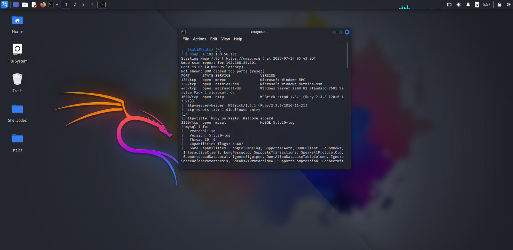
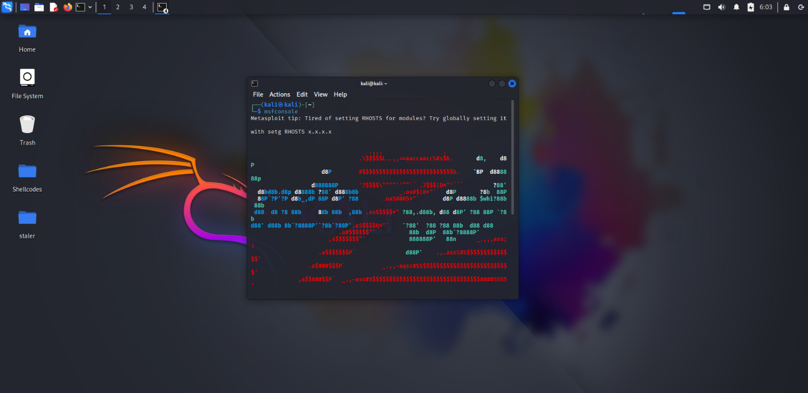
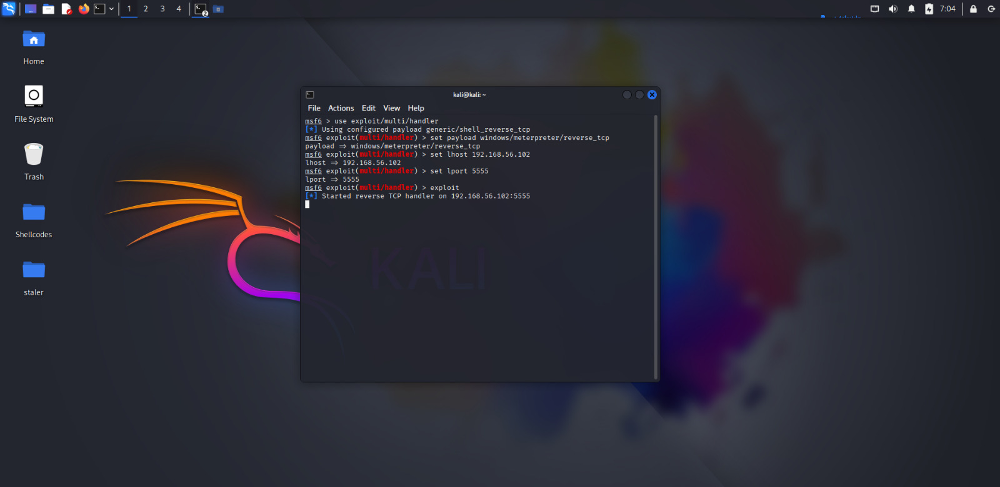
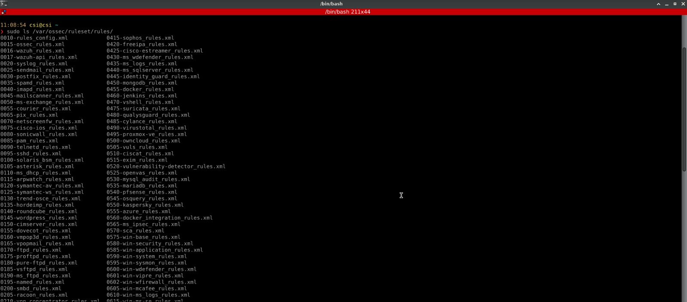
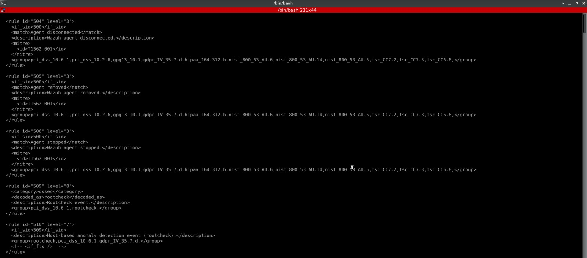
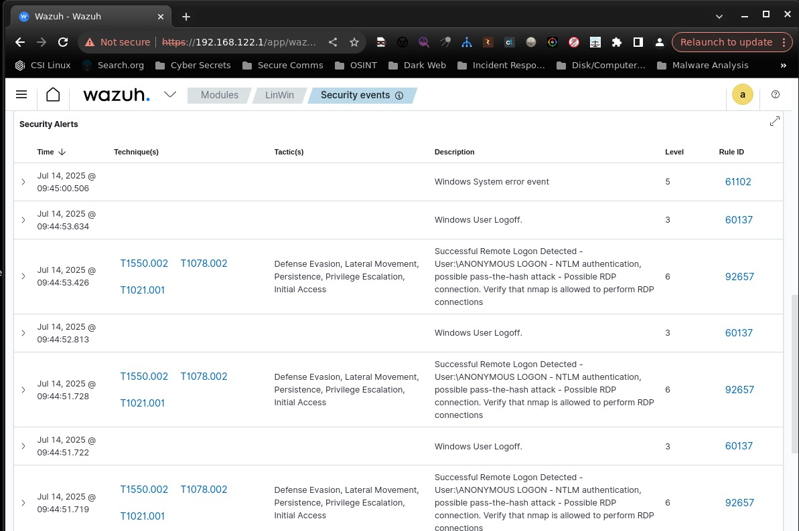
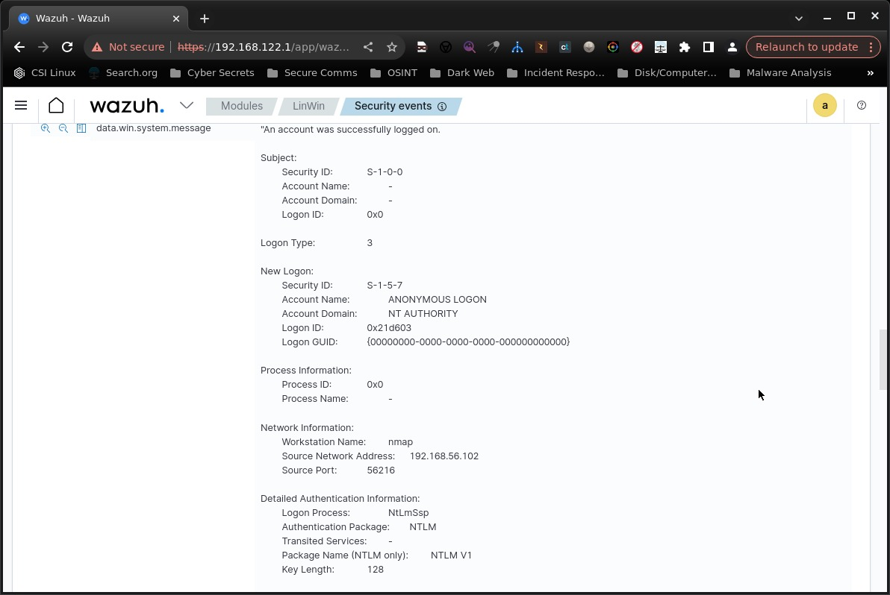
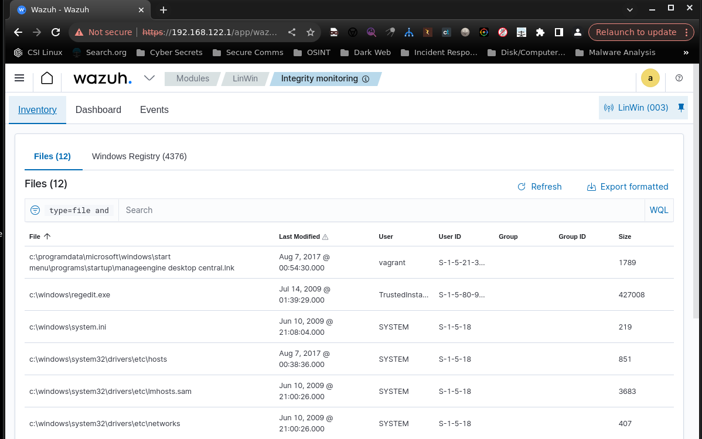
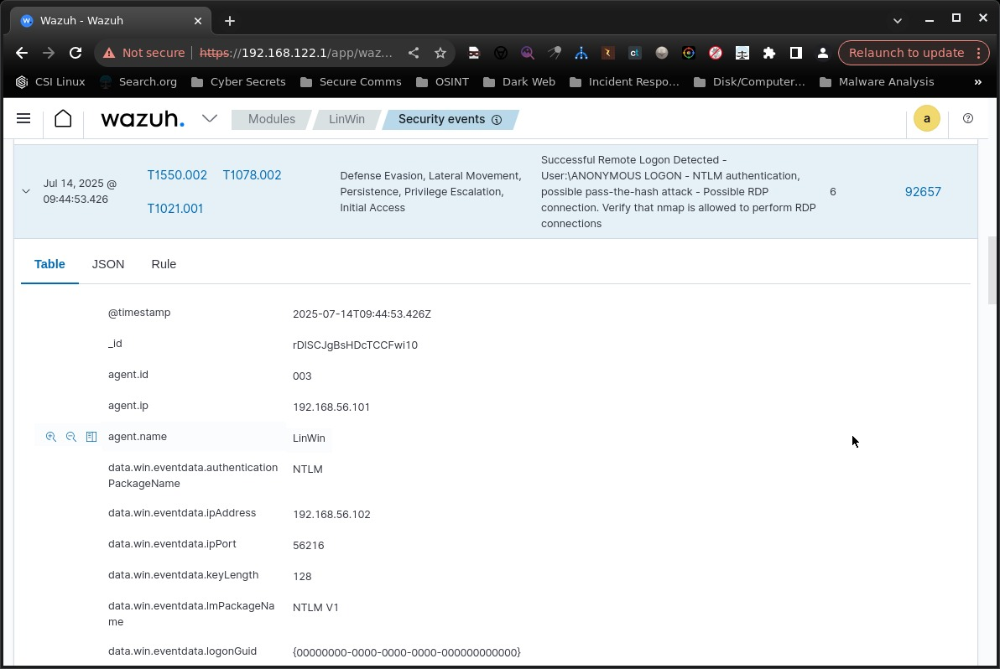
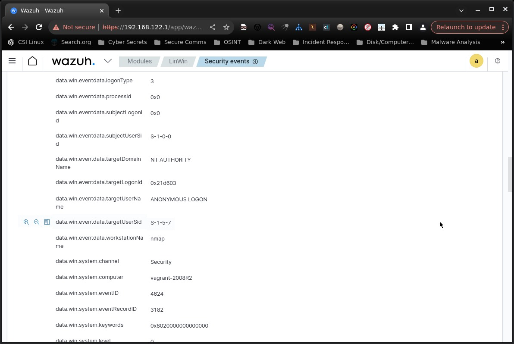

# 🛡️ Host-Based Intrusion Detection System using Wazuh

---

## 1. Introduction

This project demonstrates the setup and use of a **Host-Based Intrusion Detection System (HIDS)** using **Wazuh** to detect, alert, and analyze malicious activity across Windows and Linux endpoints. The goal was to build a functioning intrusion detection setup that can simulate real-world cyberattacks and analyze system responses through custom detection rules and alert logs.

This project is intended for anyone exploring security monitoring, blue teaming, or learning how to configure and evaluate a host-based detection system.

---

## 2. Objectives

The key objectives of this project were:

- To install and configure a centralized Wazuh Manager
- To deploy Wazuh agents on Windows and Linux machines
- To simulate common attack techniques such as reverse shells, and unauthorized file changes
- To write and apply custom rules for better detection capability
- To analyze alert logs generated during attack simulations
- To gain hands-on understanding of how host-based intrusion detection systems operate in practice

---

## 3. Tools & Technologies

Below are the main tools and platforms used in this project:

  Tool/Technology --------> Purpose 
-------------------------------------
- **Wazuh Manager** | Centralized monitoring, rule evaluation, and alert generation 
- **Wazuh Agent**   | Deployed on Windows endpoint to monitor local activity 
- **Windows Server 2008**    | Wazuh Agent endpoint for simulating Windows-based attacks 
- **Kali Linux**    | Used as an attacker machine to run tools like Metasploit and nmap 
- **CSI Linux**     | Host OS for Wazuh Manager && Security Operations  
- **VirtualBox**    | Virtual environment hosting all systems 
- **Metasploit**    | Used for reverse shell attack simulation 
- **Nmap**          | Used for port scanning and reconnaissance simulation 

---

## 4. Wazuh's Components

Wazuh has several components structured together for various purpose so understanding of these compnents is required for this project.

###  Wazuh Server
The Wazuh Server is the central brain of the Wazuh platform. It processes security data collected by agents, evaluates it against rule sets, generates alerts, and handles configuration and communication between components. It consists of the Wazuh Manager, Wazuh Indexer, and Wazuh Dashboard.

### Wazuh Manager
The Wazuh Manager is responsible for: Receiving log and event data from agents, Decoding and correlating events, Applying rule sets to detect suspicious behavior, Generating security alerts, Sending logs to the, Indexer for storage, It's the core component responsible for detection and alert logic.

### Wazuh Indexer
Wazuh Indexer (formerly based on OpenSearch/Elasticsearch) is a search and storage engine that stores all collected logs, alerts, and events. It allows users to query, filter, and analyze data efficiently. It enables full-text search and powers the backend of the Wazuh Dashboard.

### Wazuh Agents
Wazuh Agents are lightweight programs installed on endpoint systems (Linux, Windows, macOS) that: Monitor files, processes, logs, and network activity, Send data to the Wazuh Manager for analysis, Receive updated configuration and rule sets from the manager, they are crucial for real-time host-level visibility.

### Wazuh Dashboard
The Wazuh Dashboard is a web-based GUI that provides: Real-time alert monitoring, System health status, Visualization of log and rule matches, Custom dashboard creation, It simplifies the management and investigation of alerts across all monitored systems.

### Rule Sets
Wazuh uses predefined and custom rule sets to detect known attack patterns, suspicious behavior, and anomalies. Each rule includes: A unique ID, a severity level (0–15), conditions to match against event data, custom rules can be created to detect specific behaviors, such as reverse shells, unauthorized access, or file changes, making Wazuh highly adaptable.

---

## 5. Attack Simulations
To test the effectiveness of the Wazuh setup, the following attacks were simulated from the Kali Linux VM targeting Windows 2008 server machine:

### 1. Port Scanning:
   
**Tool Used:** Nmap  

**Purpose:** Reconnaissance to identify open ports 

**Command Used:**

```bash
nmap -sS -T4 -A 192.168.56.101
```




### 2. File Modification (Integrity Check):

**Tool Used:** Manual file tampering 

**Purpose:** Test file integrity monitoring

**Command Used:**
echo "unauthorized change" >> /etc/passwd

### 3. Reverse Tcp (Custom rule implementation):

**Tool Used:** Metasploit

**Purpose:** Test with a real attack simulation 

### - msfconsole



### - reverse_tcp



---

## 6. Detection Logoic

Wazuh uses a layered detection architecture that includes log collection, decoding, rule correlation, and alerting. This design allows it to act as a powerful Host-based Intrusion Detection System (HIDS).

---

### 1️. Data Collection (Log & Event Gathering)

Wazuh collects security-relevant data from monitored systems using agents (or agentlessly):

- Linux and Windows system logs
- Command execution records
- File integrity checks
- Registry monitoring (Windows)
- Auditd logs (Linux)
- Rootcheck scans

The data is securely forwarded to the Wazuh Manager.

---

### 2. Decoders (Log Normalization)

Before any rule can be applied, raw logs are decoded.

**Purpose:** Extract structured fields from unstructured logs using decoders.

**Example Log:** sshd[2254]: Failed password for invalid user admin from 192.168.0.100 port 55874

**Decoded Output:**
- Program: `sshd`
- Event: `Failed password`
- IP: `192.168.0.100`
- Username: `admin`

 Decoders enable consistent field matching for the rules engine.

---

### 3. Rules Engine (Event Correlation)

After decoding, logs are evaluated against Wazuh's rule base.

Each rule consists of:
- `match`, `regex`, or `field` conditions
- `id`: Unique identifier for the rule
- `level`: Severity score (0–15)
- `description`: Explains the rule
- `if_sid`: Chains rules together
- `group`: Tags rule types (e.g., `authentication_failed`)

**Rule Hierarchy:**
- **Low-level rules**: Detect simple events (e.g., login failure)
- **High-level rules**: Correlate multiple events (e.g., brute-force attack)

---

### 4. Alert Generation

When a rule is matched, an alert is generated:

- Stored in:  
  - `/var/ossec/logs/alerts/alerts.log`  
  - `/var/ossec/logs/alerts/alerts.json`  
- Displayed in the **Wazuh Dashboard**
- Can be forwarded to SIEM, email, Slack, etc.

**Alert includes:**
- Rule ID and severity
- Matched log
- Agent details
- Time of occurrence
- Original log and decoded fields

---

### 5. Wazuh Modules That Enable Detection

| Module            | Purpose                                      |
|-------------------|----------------------------------------------|
| `syscheck`        | File integrity monitoring                    |
| `rootcheck`       | Rootkit detection and hidden file scanning   |
| `auditd`          | Monitors system calls and sensitive actions  |
| `command`         | Detects specific command-line executions     |
| `registry`        | Monitors Windows registry keys               |
| `OpenSCAP`        | Checks compliance policies                   |
| `active-response` | Executes response scripts on matching alerts |

---

Wazuh comes with a large set of default rules, and you can find them in a specific directory on the Wazuh Manager.

On your Wazuh Manager (Linux), default rule files are stored in:
```
sudo /var/ossec/ruleset/rules/
```



View any of the rules file in detail to view all the predefined rules in that by using ```cat```



---

## 7. Log Analysis After Nmap Scan




- By clicking on any particular log it can be viewed in detail 



- Event ID 61102 – Windows System Error Event

Jul 14, 2025 @ 09:44:30.477
Rule ID: 61102
Level: 5

Description: Windows System error event

This is a general error event from the Windows Event Log. It likely occurred because Nmap's aggressive scan (-A) triggered services (like RDP, SMB, or WMI) to respond with errors. This is common when : Ports are probed, OS detection is attempted, Services are banner-grabbed, it’s not a high-priority alert, but it tells you something unexpected or abnormal hit the system.

 - Event ID 92657 – Successful Remote Logon (Anonymous)
   
Jul 14, 2025 @ 09:44:48.521
Rule ID: 92657
Level: 6

Description: Successful Remote Logon Detected - User: \ANONYMOUS LOGON - NTLM authentication, possible pass-the-hash attack - Possible RDP connection. Verify that nmap is allowed to perform RDP connections

This one is very interesting — here’s what happened: Nmap’s -A scan tries OS detection, version detection, and often probes RDP (port 3389), SMB, WMI, etc. During this, NTLM authentication attempts might get logged. Windows logs this as a successful logon by an anonymous user — a behavior associated with: Nmap, SMB enumeration, pass-the-hash or info-gathering tools. Wazuh flags it as suspicious, possibly indicating: Reconnaissance, Credential-less probing, an attacker trying RDP connection or anonymous SMB login.

## 8. Integrity Monitoring After File Modification

Integrity monitoring in Wazuh is a critical security feature that tracks unauthorized changes to files, directories, or Windows registry keys on monitored systems.

What It Does: Wazuh watches important files and directories (or registry keys on Windows) and alerts you when something changes. 

What changes could occur and why it matter:
- File created/modified	-->  Could be malware dropped or config changed
- File deleted	--> Could be log tampering or evidence wiping 
- Permissions changed --> Could indicate privilege escalation 
- Registry key modified (Win) -->	Could mean persistence or malware installed

On Windows
It watches for:
- Changes to registry keys (startup entries, policies, etc.)
- Modifications in C:\Windows\System32
- Dropped executables in Downloads or Temp



Where to Configure It
Wazuh config file on the agent: 
```
/etc/ossec/ossec.conf
```

Where Alerts Show Up
When a change happens, Wazuh sends an alert like:

```
{
  "rule": {
    "id": 550,
    "description": "Integrity checksum changed."
  },
  "agent": {
    "name": "Windows-VM"
  },
  "file": "/etc/ssh/sshd_config"
}
```

## 9. Understanding Logs In Depth






###  Summary of the Event

| **Field** | **Description** |
|-----------|------------------|
| **Rule** | Wazuh generated an alert for **"Successful Remote Logon Detected"**, likely matched from **Event ID 4624**. It indicates that a remote logon was successfully performed on the system. |
| **MITRE ATT&CK IDs** | `T1550.002`, `T1078.002`, `T1021.001` — these describe **Pass-the-Hash**, **Valid Accounts**, and **Remote Services (like RDP)** respectively. These mappings help identify the tactics used. |
| **Description** | Indicates **NTLM authentication** via an **anonymous logon**, possibly an RDP connection or Nmap probing using NTLM fallback. |

---

###  Table Breakdown – Key Fields

---

###  General Fields

| **Field** | **Meaning** |
|-----------|-------------|
| `@timestamp` | Time when the event was logged (in UTC). |
| `agent.id` | Unique ID assigned to the Wazuh agent (your Windows machine) — in this case `003`. |
| `agent.name` | The hostname of the agent system — here it's `LinWin`. |
| `agent.ip` | IP address of the system where the Wazuh agent is running (`192.168.56.101`). |

---

###  Authentication Information

| **Field** | **Meaning** |
|-----------|-------------|
| `data.win.eventdata.authenticationPackageName` | Authentication protocol used — here it's `NTLM`. |
| `data.win.eventdata.ImPackageName` | Version of the NTLM protocol (`NTLM V1` used here, which is insecure). |
| `data.win.eventdata.keyLength` | Encryption key length used in the NTLM authentication — `128` bits. |

---

### Logon Details

| **Field** | **Meaning** |
|-----------|-------------|
| `data.win.eventdata.logonType = 3` | Type 3 means **network logon**, typically used for RDP, SMB, etc. |
| `data.win.eventdata.targetUserName = ANONYMOUS LOGON` | Shows that **no real user account** was used — it’s an anonymous authentication attempt. |
| `data.win.eventdata.targetDomainName = NT AUTHORITY` | The logon occurred under the **local system context**, not a domain user. |
| `data.win.eventdata.targetUserSid = S-1-5-7` | SID for "Anonymous Logon" — built-in in Windows. |

---

###  Subject & Logon Info

| **Field** | **Meaning** |
|-----------|-------------|
| `subjectLogonId = 0x0` | System process performed the logon; not a logged-in user. |
| `subjectUserSid = S-1-0-0` | Null SID — another indicator that this was anonymous. |
| `logonGuid` | Globally unique ID for the logon session (often all zeros in anonymous or failed logons). |

---

###  Network Context

| **Field** | **Meaning** |
|-----------|-------------|
| `workstationName = nmap` | The scanning machine's hostname was set as `nmap` (possibly spoofed by attacker or auto set by Nmap). |
| `ipAddress = 192.168.56.102` | IP of the system attempting to authenticate. |
| `ipPort = 56216` | Source port of the remote connection attempt. |

---

###  Event Metadata

| **Field** | **Meaning** |
|-----------|-------------|
| `data.win.system.eventID = 4624` | Windows Event ID for **"An account was successfully logged on"**. This is standard for any successful login. |
| `data.win.system.computer = vagrant-2008R2` | The target system (likely your vulnerable **Windows Server 2008 R2** VM). |
| `data.win.system.channel = Security` | This is a **security log** event. |
| `data.win.system.eventRecordID = 3182` | Unique log ID number in the **Windows Event Log**. |

---

This event can indicate reconnaissance or an attempted remote access by a threat actor using weak authentication protocols like NTLMv1 and anonymous logons. Properly tuning Wazuh rules and monitoring related events (4625, 4648, etc.) is crucial for detecting lateral movement or credential abuse.

---

###  Interpretation

This log indicates that an **anonymous network login** succeeded on your Windows system via **NTLMv1**, which is outdated and vulnerable. The remote machine identified as `nmap`, suggesting that this was caused by an aggressive scan or exploit attempt.

This type of event may precede:
- RDP brute-force attacks
- Pass-the-Hash exploitation
- Reconnaissance using `nmap -A`

---

###  Recommendations

| Action | Why |
|--------|-----|
|  Disable NTLMv1 | It's insecure and deprecated. |
|  Block Anonymous Logons | Prevent unauthenticated access to services. |
|  Tune Wazuh Rules | Raise severity for anonymous or null SID logons. |
|  Use Active Response | Auto-block suspicious IPs via Wazuh on detection. |
|  Monitor for similar Event IDs | Especially 4625 (failed logons), 4648 (logon using explicit credentials), etc. |

---

###  MITRE ATT&CK Mapping

| Tactic | Technique | ID |
|--------|-----------|----|
| Credential Access | Pass-the-Hash | T1550.002 |
| Initial Access | Remote Services (RDP) | T1021.001 |
| Persistence / Lateral Movement | Valid Accounts | T1078.002 |

---


## 10. Findings

This section summarizes the effectiveness of the Wazuh HIDS setup based on the simulated attacks and detection performance.

###  Successfully Detected

- **Reverse Shell (bash TCP)** triggered the custom rule and was flagged immediately.
- **Port Scanning (Nmap)** was detected using default Wazuh rules.
- **File Modifications** on critical system files (e.g., `/etc/passwd`) were detected via the `syscheck` module.

###  Missed or Not Detected

- **Obfuscated Commands** (e.g., base64-encoded reverse shell payloads) were initially not detected.
- Some **Windows Event Log activities** (e.g., PowerShell abuse) required manual tuning and additional rules.

###  Tuning & Improvements

- Created custom rules for base64 patterns in Linux and encoded PowerShell on Windows.
- Adjusted FIM settings to monitor high-value files more frequently.
- Increased alert log retention and enabled verbose agent logging for deeper analysis.
- Configured Wazuh Dashboard widgets to track custom rule hits over time.

---

## 11. Missed/Not Detected 

Why Was the Reverse TCP Payload Not Detected by Default Wazuh Rules?

Despite executing a reverse TCP payload using `msfvenom` (e.g., `windows/meterpreter/reverse_tcp`), Wazuh **did not generate an alert** by default. Here's a detailed explanation of **why this occurred** and **how it was resolved**.

---

###  Why Wazuh Did Not Detect the Reverse Shell by Default

| Root Cause | Explanation |
|------------|-------------|
| **Wazuh is Host-Based (Not Network-Based)** | Wazuh analyzes **host logs** only. It doesn't monitor raw network traffic unless a service or process logs something suspicious. |
| **Windows Logs Are Limited by Default** | Default Windows auditing does **not log process executions** like `cmd.exe` or `powershell.exe` unless advanced logging is enabled. |
| **Wazuh Relies on Specific Logs** | If there's **no relevant log entry**, the Wazuh ruleset cannot trigger a detection. |
| **Reverse TCP is Stealthy by Design** | The payload executes **in memory**, mimicking normal processes. It does not drop files or visibly crash anything unless configured to do so. |

---

###  What Would Have Detected the Reverse Shell

| Detection Method | Works? | Why |
|------------------|--------|-----|
|  **Wazuh Default FIM (File Integrity Monitoring)** | ❌ | No file changes occurred. |
|  **Default Wazuh Ruleset** | ❌ | No default rule matched the stealthy process execution. |
|  **Custom Wazuh Rule (Event ID 4688)** | ✅ | We wrote a custom rule to alert on suspicious process creation (`cmd.exe`, `powershell.exe`). |
|  **Sysmon + Wazuh** | ✅ | Sysmon logs detailed process and network activity, which Wazuh can alert on. |
|  **Suricata / Zeek (NIDS)** | ✅ | These tools detect suspicious outbound reverse shell traffic on the network. |
|  **EDR / Defender ATP** | ✅ | Behavioral detection based on memory injection or known IOCs. |

---

###  Custom Rule Solution

To address this gap, we implemented a **custom Wazuh rule** that triggers alerts based on Windows Event ID `4688` (new process creation) and matches suspicious processes like `cmd.exe`, `powershell.exe`, and others commonly used in reverse shell payloads.

```xml
<rule id="100010" level="10">
  <if_sid>61613</if_sid>
  <field name="win.system.eventID">4688</field>
  <match>cmd.exe</match>
  <description>Suspicious Process: Possible Reverse Shell (cmd.exe)</description>
</rule>

<rule id="100011" level="12">
  <if_sid>61613</if_sid>
  <field name="win.system.eventID">4688</field>
  <match>powershell.exe</match>
  <description>Suspicious Process: Possible Reverse Shell (PowerShell)</description>
</rule>
```


## 11. Conclusion

This project provided hands-on experience with deploying and configuring a Host-Based Intrusion Detection System using Wazuh in a virtual lab. Key takeaways include:

###  What I Learned

- Installation and configuration of a complete Wazuh stack
- Creating and deploying custom detection rules
- Simulating realistic attacks and observing detection mechanisms
- Log analysis and alert triage using both CLI and GUI tools

###  Strengths of the Setup

- Cross-platform support (Linux and Windows)
- Real-time monitoring with high configurability
- Modular rule system and built-in FIM capabilities

###  Limitations

- Requires manual rule tuning for sophisticated or obfuscated attacks
- False positives in aggressive scanning scenarios
- Lacks integrated alert delivery (e.g., Slack/email) out of the box

###  Real-World Relevance

This HIDS setup closely resembles real-world SOC environments where:
- Endpoint monitoring is crucial for incident detection
- Analysts investigate alerts and perform rule tuning regularly
- HIDS tools integrate with SIEMs for broader threat visibility

---

## 12. Future Enhancements

The following improvements are planned or recommended:

-  **Integrate Slack/Email alerts** for faster triage
-  **Forward Wazuh alerts to ELK or Splunk** for better visualization and correlation
-  **Write advanced correlation rules** for multi-event attack chains (e.g., persistence + privilege escalation)
-  **Deploy agents in AWS VMs or EC2 instances** to test cloud-based detection
-  **Automate rule tuning** based on incident feedback and threat intelligence feeds

---

## 13. References

- 📘 [Wazuh Documentation](https://documentation.wazuh.com/current/index.html)
- 📦 [Wazuh GitHub](https://github.com/wazuh/wazuh)
- 📄 [MITRE ATT&CK](https://attack.mitre.org/)

