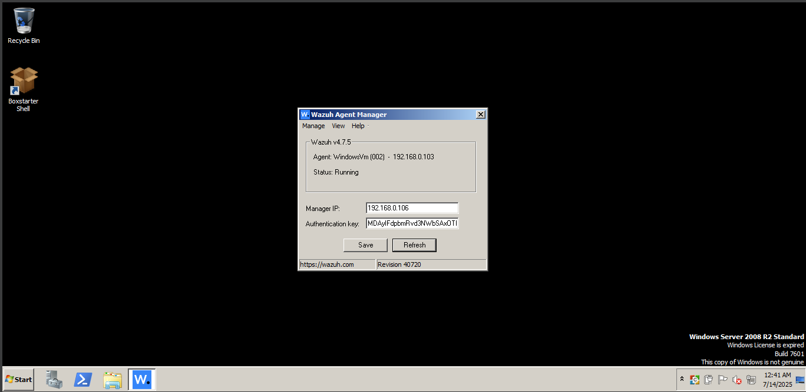
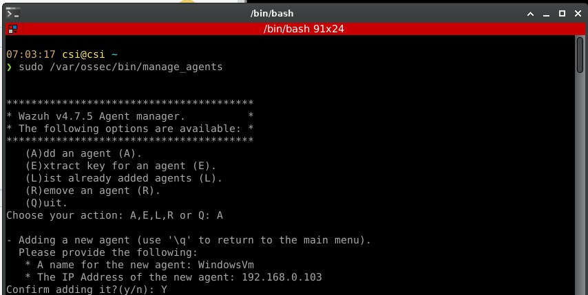
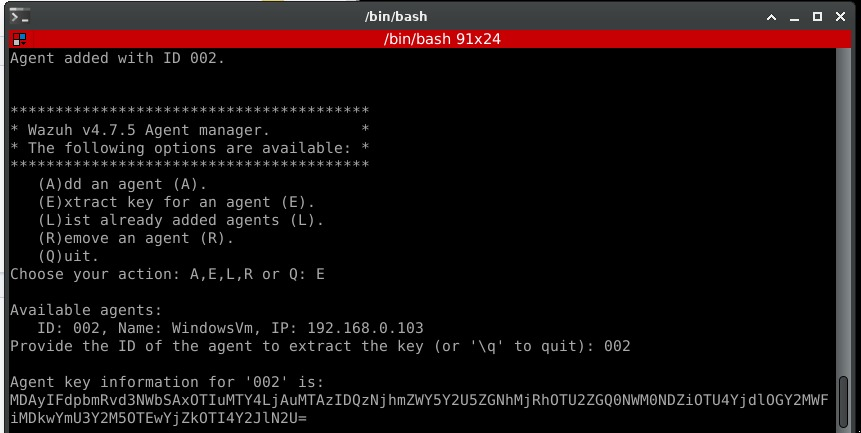
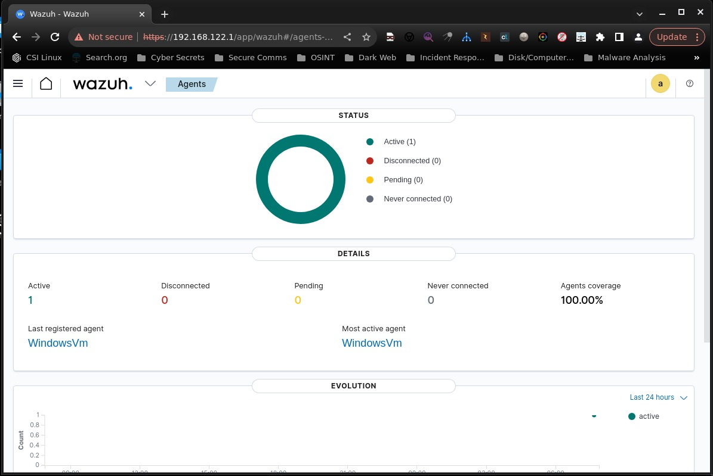
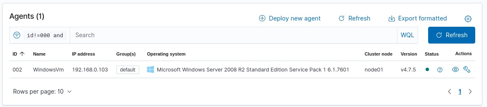

## 🔧 Setup Process

This section covers the complete installation and configuration process of the Wazuh HIDS environment including the manager, agents, and custom rule deployment.

---

### 1. Wazuh Manager Setup (Ubuntu 22.04)

The Wazuh Manager handles event correlation, rule evaluation, and alerting. It also hosts the Wazuh Dashboard and Indexer.

#### - Install Wazuh All-In-One (Manager, Dashboard, Indexer)

```bash
# Download Wazuh install script
curl -sO https://packages.wazuh.com/4.7/wazuh-install.sh

# Run the script with all-in-one installation
sudo bash wazuh-install.sh -a
```

####  Post-Installation Access

- Wazuh Dashboard: `https://<wazuh-manager-ip>`
- Default credentials:
  - **Username**: `admin`
  - **Password**: retrieved from installation process

---

### 2. Wazuh Windows Agent Setup (Windows VM)

1. Download `.msi` agent installer:\
   [https://packages.wazuh.com/4.x/windows/wazuh-agent-4.x.x.msi](https://packages.wazuh.com/4.x/windows/wazuh-agent-4.x.x.msi)

2. Run the installer and during setup:

   - Set the **Wazuh Manager IP**
   - Provide a unique **agent name** (e.g., `win-agent`)
   - Accept default ports and enable firewall exception if prompted



3. Start the service:  Open Powershell 
 ```
 Net Start wazuh
 ```
---

### 3. Register Agents on Wazuh Manager

On the Wazuh Manager:

```bash
sudo /var/ossec/bin/manage_agents
```


Use the key output to register the agent on the remote system.

 

---

### 4. Configure ossec.conf (Optional Tuning)

On the Wazuh Manager:

```bash
sudo nano /var/ossec/etc/ossec.conf
```

Optional edits:

- Enable or adjust FIM, rootcheck, and log sources
- Increase alert levels or retention settings

Restart to apply changes:

```bash
sudo systemctl restart wazuh-manager
```

---

### 5. Verify Setup

Go to dasboard and agents are visible their:

 

All the available agents are shown their:



Check the status of the manager and agent:
```
sudo systemctl status wazuh-manager
```
```
sudo systemctl status wazuh-agent
```

- Ensure agents are listed as `active` in Wazuh Dashboard
- Simulate attacks (e.g., reverse shell or file change)
- Check for generated alerts:
  - Wazuh Dashboard → Security Events
  - `/var/ossec/logs/alerts/alerts.log`

---
